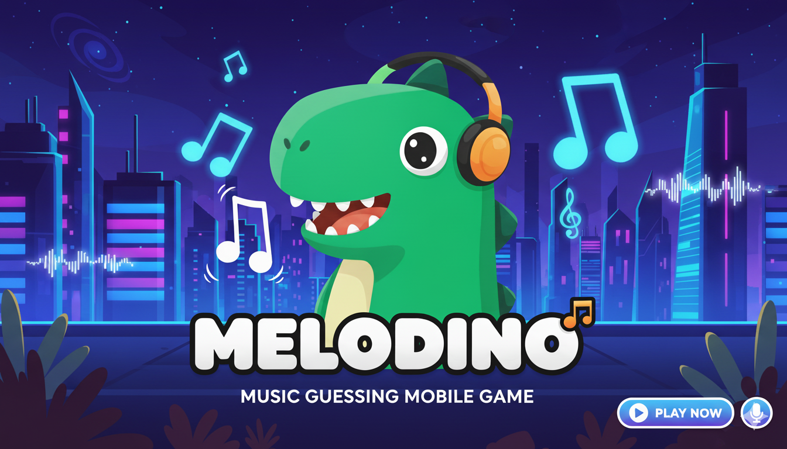

# Melodino 🎵🦖



**Melodino** is an engaging music guessing game for Android where players test their musical knowledge by identifying songs from short audio clips. The less time you need to guess correctly, the more points you earn!

## 🎮 How to Play

1. **Enter Your Name** - Start by introducing yourself on the welcome screen
2. **Listen to the Song** - Tap the play button to hear a fragment of the mystery song
3. **Make Your Guess** - Type your answer and submit
4. **Earn Points** - Guess quickly to maximize your score!

### Game Mechanics

- You have **5 attempts** to guess the correct song
- Initial playback starts at **1 second**
- After each incorrect attempt, the playback duration increases by **1.6x**
- **Scoring system**: Less listening time = More points
  - 1-2 seconds = 5 points
  - 2-3 seconds = 4 points
  - 3-6 seconds = 3 points
  - 6-10 seconds = 2 points
  - 10+ seconds = 1 point

## ✨ Features

- **Progressive Difficulty**: Song playback duration increases with each failed attempt, giving you more clues
- **Visual Feedback**: 
  - Progress bar showing how much of the song will be played
  - Points display showing potential score
  - Strikethrough on incorrect answers
- **Score Tracking**: Keep track of your performance across games
- **Win/Lose Screens**: 
  - Celebrate victories with score breakdown and bonuses
  - Learn from losses with the correct answer revealed
- **Share Your Achievement**: Share your winning scores with friends


## 🛠️ Technical Details

### Built With
- **Language**: Java
- **UI Framework**: Android XML Layouts with ConstraintLayout
- **Audio**: MediaPlayer API
- **Data Persistence**: SharedPreferences
- **Minimum SDK**: Android 5.0 (API 21)

### Project Structure
```
app/
├── src/main/java/
│   ├── MainActivity.java          # Main game screen
│   ├── WelcomeActivity.java       # Welcome/login screen
│   ├── WinActivity.java           # Victory screen
│   ├── GameOverActivity.java      # Game over screen
│   └── AudioPlayer.java           # Audio playback helper
├── res/
│   ├── layout/                    # XML layouts
│   ├── drawable/                  # Icons and backgrounds
│   ├── raw/                       # Audio files (songs)
│   └── values/                    # Colors, strings, styles
```


## 👥 Author

Esteban Hirzfeld

## 🙏 Acknowledgments

- Music guessing game concept inspired by popular music quiz games
- Icon assets from Material Design
- Built with guidance from Android documentation

